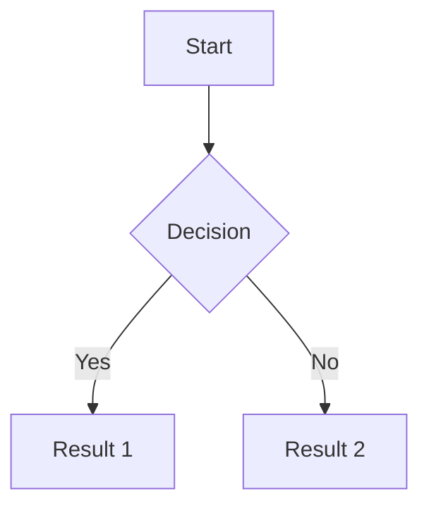

# Github pages mkdocs

## Criar o Repositório no GitHub

Crie um novo repositório no GitHub, configurando-o como privado.

## Configurar MkDocs

Instale o MkDocs se ainda não o fez:

```bash
pip install mkdocs
```

No diretório da documentação, crie a estrutura inicial do MkDocs:

```bash
mkdocs new my-project
cd my-project
```

## Modificar config

Edite o arquivo mkdocs.yml para configurar o projeto conforme necessário. Exemplo:

```yaml
site_name: MKDocs
plugins:
  - mermaid2

theme:
  name: material
```

## Gerar a Documentação

Gere os arquivos estáticos:

```bash
mkdocs build
```

## Configurar o Deploy com GitHub Actions

Crie um arquivo `.github/workflows/deploy.yml` no seu repositório para automatizar o deploy usando GitHub Actions. Eis um exemplo de configuração:

```yaml
name: Deploy MkDocs

on:
  push:
    branches:
      - main

jobs:
  deploy:
    runs-on: ubuntu-latest

    steps:
      - name: Check out the repository
        uses: actions/checkout@v2

      - name: Set up Python
        uses: actions/setup-python@v2
        with:
          python-version: '3.x'

      - name: Install dependencies
        run: |
          pip install mkdocs
          pip install mkdocs-material
          pip install mkdocs-mermaid2-plugin

      - name: Deploy to GitHub Pages
        run: |
          mkdocs gh-deploy --force
        env:
          GITHUB_TOKEN: ${{ secrets.GITHUB_TOKEN }}
```

## Configurar pages

- Vá até a seção `Build and deployment` de `Pages`;
- Selecione `Deploy from a branch`;
- Selecione também a branch `main` e o folder `/docs` e salve.

Agora basta visitar o site.

## Configurar permissões

Em `Workflow permissions` selecione a opção `Read and write permissions`.

## Mermaid

Uma renderização de markdown deverá ficar como:


