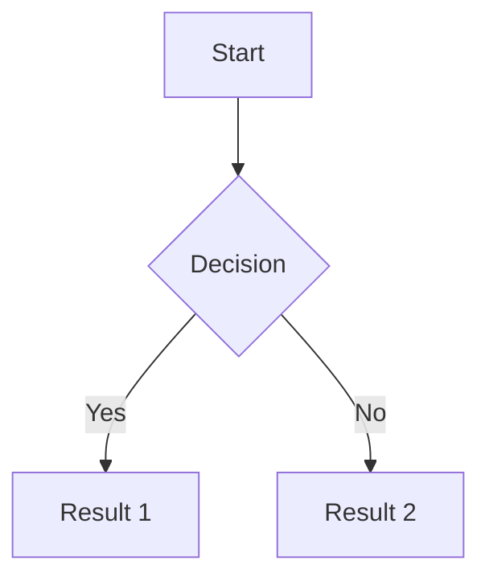

# Github pages mkdocs

## Criar o Repositório no GitHub

Crie um novo repositório no GitHub, configurando-o como privado.

## Configurar MkDocs

Instale o MkDocs se ainda não o fez:

```bash
pip install mkdocs
```

No diretório da documentação, crie a estrutura inicial do MkDocs:

```bash
mkdocs new my-project
cd my-project
```

## Modificar config

Edite o arquivo mkdocs.yml para configurar o projeto conforme necessário. Exemplo:

```yaml
site_name: MKDocs

plugins:
  - mermaid2
  - search
theme:
  name: material
```

## Configurar o Deploy com GitHub Actions

Crie um arquivo `.github/workflows/ci.yml` no seu repositório para automatizar o deploy usando GitHub Actions. Eis um exemplo de configuração:

```yaml
name: mkdocs

on:
  push:
    branches:
      - main

permissions:
  contents: write

jobs:
  deploy:
    runs-on: ubuntu-latest
    steps:
      - uses: actions/checkout@v4
      - name: Configure Git Credentials
        run: |
          git config user.name github-actions[bot]
          git config user.email 41898282+github-actions[bot]@users.noreply.github.com
      - uses: actions/setup-python@v5
        with:
          python-version: 3.12.6
      - run: echo "cache_id=$(date --utc '+%V')" >> $GITHUB_ENV
      - uses: actions/cache@v4
        with:
          key: mkdocs-material-${{ env.cache_id }}
          path: .cache
          restore-keys: |
            mkdocs-material-
      - run: pip install mkdocs-material
      - run: pip install mkdocs-mermaid2-plugin
      - run: mkdocs gh-deploy --force
```

## Configurar pages

- Vá até a seção `Build and deployment` de `Pages`;
- Selecione `Deploy from a branch`;
- Selecione também a branch `gh-pages` e o folder `/` e salve.

Agora basta visitar o site.

## Mermaid

Uma renderização de markdown deverá ficar como:



## Video


